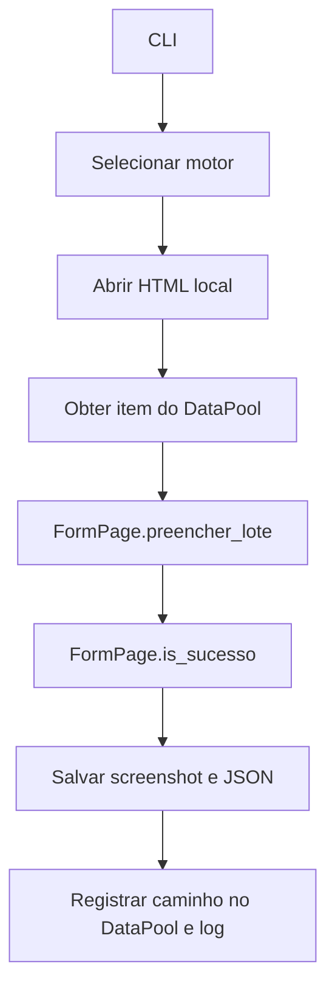

# PDD — Automação de Cadastro de Lotes

## Objetivo

Automatizar, em ambiente local fictício, o cadastro de lotes com Selenium ou
Playwright, mantendo rastreabilidade por log, screenshot, JSON e DataPool.

## Arquitetura e responsabilidades

- `src/pages`: locators, esperas explícitas e ações da interface.
- `src/automation`: fluxo, tratamento de exceções, logs e evidências.
- `src/main.py`: configuração e seleção do motor.
- `JsonDataPool`: implementação local do contrato `DataPool`; o contrato permite
  injetar um adaptador BotCity Maestro sem alterar Pages ou orquestradores.

`LoginPage` representa uma eventual tela de autenticação. O HTML de demonstração
não possui login, portanto o fluxo atual inicia diretamente em `FormPage`.

## Fluxo

Para cada lote, o orquestrador chama o Page Object, captura a tela, grava o JSON
de rastreabilidade e registra o mesmo resultado no DataPool. Falhas são logadas,
o navegador é encerrado em `finally` e a exceção é propagada.

## Evidências e DataPool

Os artefatos ficam em `evidencias/<numero-do-lote>.png` e `.json`. O arquivo
`datapool.json` simula o DataPool sem credenciais ou sistemas reais. Em Maestro,
uma classe que implemente `registrar(registro)` deve delegar ao SDK oficial.

